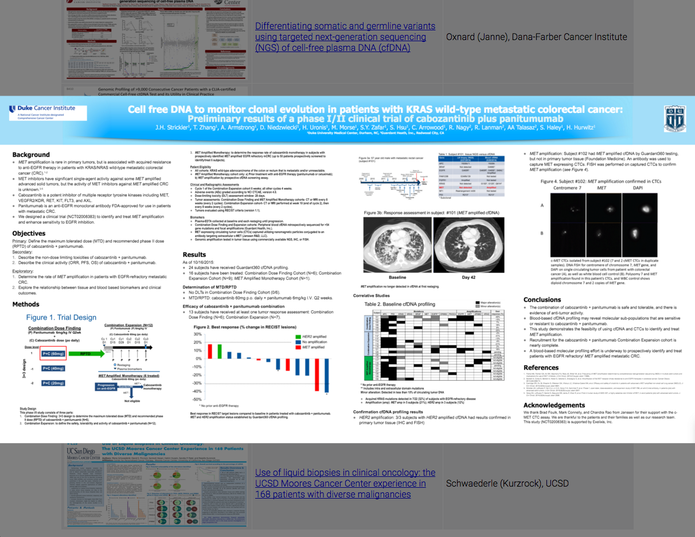

## Clickable Image Modal

#### When user clicks a image, a image (with modal) will pop up taking up page's width, and moves with the scrolling even if the document height exceeds window height

#### Example:

